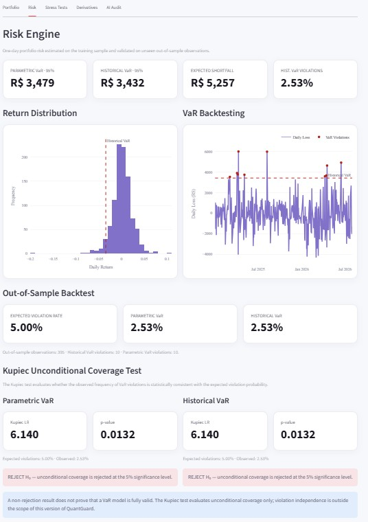

# QuantGuard AI

### Quantitative Finance as an Independent Validation Layer for AI-Generated Financial Analysis

**Can an AI-generated financial answer sound convincing and still be quantitatively inconsistent?**

QuantGuard AI was built around that question.

The project implements reproducible quantitative-finance benchmarks for **portfolio construction, market risk, stress testing and derivatives pricing**, and uses them as an independent validation layer for financial outputs generated by external AI models.

The core idea is:

**External AI Output → Quantitative Benchmark → Numerical Deviation → Reliability Assessment → Human Review**

The application is built in **Python** and exposed through an interactive **Streamlit dashboard**.

---

## Project Overview

QuantGuard AI is organized into five quantitative modules:

1. **Portfolio Intelligence**
2. **Risk Engine**
3. **Stress Testing**
4. **Derivatives Lab**
5. **AI Financial Audit**

The quantitative engine is separated from the user interface so that benchmark calculations remain independent from visualization and external AI inputs.

---

# 1. Portfolio Intelligence

The portfolio module analyzes four Brazilian equities:

* `PETR4.SA`
* `VALE3.SA`
* `ITUB4.SA`
* `WEGE3.SA`

Historical market prices are obtained programmatically through **Yahoo Finance**.

Daily returns are used to estimate:

* expected returns;
* annualized volatility;
* covariance matrix;
* portfolio risk-adjusted performance.

<p align="center">
  
</p>

---

## Portfolio Opportunity Set

QuantGuard generates **10,000 long-only random portfolios** to visualize the portfolio opportunity set.

Two optimization solutions are highlighted:

* **Maximum Sharpe Portfolio**
* **Minimum Variance Portfolio**

Optimization is performed with **SLSQP (`scipy.optimize.minimize`)** subject to:

[
\sum_{i=1}^{N} w_i = 1
]

and

[
0 \leq w_i \leq 1
]

Short selling is therefore not allowed in the current implementation.

<p align="center">
  
</p>

---

## Out-of-Sample Validation

Portfolio weights are estimated using a training sample and then **frozen** before being evaluated on unseen market observations.

### Training period

`2021 → 2024`

### Out-of-sample period

`2025 → 2026`

This temporal separation prevents the optimizer from using future observations when estimating portfolio weights.

The optimized strategies are evaluated against an **Equal Weight** benchmark.

The dashboard reports:

* in-sample expected return;
* in-sample volatility;
* in-sample Sharpe Ratio;
* out-of-sample Sharpe Ratio;
* cumulative out-of-sample portfolio growth.

---

## CDI-Adjusted Sharpe Ratio

Instead of assuming a zero risk-free rate, QuantGuard uses the Brazilian **CDI as the risk-free proxy**.

CDI data are retrieved programmatically from the **Banco Central do Brasil SGS API**, using the annualized CDI series.

The rate is aligned independently with the training and out-of-sample periods.

The Sharpe Ratio is calculated as:

[
Sharpe =
\frac{R_p - R_f}
{\sigma_p}
]

where:

* (R_p) = annualized portfolio return;
* (R_f) = annualized CDI-equivalent risk-free rate;
* (\sigma_p) = annualized portfolio volatility.

This prevents Brazilian equity portfolios from being evaluated against an unrealistic zero-rate benchmark.

---

# 2. Risk Engine

QuantGuard estimates one-day portfolio risk using:

* **Parametric Value at Risk**
* **Historical Value at Risk**
* **Expected Shortfall**

<p align="center">
  
</p>

### Parametric VaR

VaR estimated under a normal-return assumption.

### Historical VaR

VaR obtained from the empirical distribution of historical portfolio returns.

### Expected Shortfall

Average loss conditional on returns falling beyond the VaR threshold.

All risk estimates are converted into monetary losses using the configured portfolio value.

---

## Out-of-Sample VaR Backtesting

Risk measures are calibrated on the training sample and evaluated on the unseen test period.

A **VaR violation** occurs when the realized portfolio loss exceeds the estimated VaR threshold.

For a 95% VaR:

[
P(\text{violation}) = 5%
]

QuantGuard reports:

* number of out-of-sample observations;
* number of violations;
* expected violation rate;
* observed violation rate.

---

## Kupiec Unconditional Coverage Test

Counting violations alone is not sufficient to formally assess VaR coverage.

QuantGuard therefore implements the **Kupiec Proportion of Failures Test**.

The null hypothesis is:

[
$$
H_0: p_{\text{observed}} = p_{\text{expected}}
$$
===================

p_{\text{expected}}
]

The likelihood-ratio statistic is evaluated against a chi-square distribution with one degree of freedom.

The dashboard reports:

* Kupiec likelihood-ratio statistic;
* p-value;
* expected violation frequency;
* observed violation frequency;
* `REJECT H₀` or `DO NOT REJECT H₀`.

A non-rejection result **does not prove that the VaR model is fully valid**.

The current implementation evaluates **unconditional coverage only**. Temporal independence and clustering of violations are outside the scope of this version.

---

# 3. Stress Testing

QuantGuard implements two stress-testing approaches:

1. **Historical Stress**
2. **Market Factor Stress**

<p align="center">
  
</p>

---

## Historical Stress

The optimized portfolio weights are applied to market behavior observed during the **2020 COVID-19 crash**.

This provides an estimate of how the current portfolio allocation would have behaved under that historical market episode.

---

## Market Factor Stress

Asset sensitivity to the Ibovespa is estimated through:

[
\beta_i =
\frac{Cov(R_i,R_m)}
{Var(R_m)}
]

The framework then simulates a:

[
-20%
]

shock to the market factor and estimates the corresponding portfolio impact.

The betas are estimated from market data rather than manually assigned.

---

# 4. Derivatives Lab

The derivatives module prices a **European call option** using an analytical solution and a numerical approximation under consistent assumptions.

<p align="center">
  
</p>

---

## Black-Scholes

Closed-form analytical solution for the European call price.

## Monte Carlo

Numerical estimate obtained by simulating the terminal asset price under geometric Brownian motion and discounting the expected option payoff.

The controlled scenario currently uses:

```text
Spot price:        100
Strike:            100
Maturity:          1 year
Risk-free rate:    5%
Volatility:        20%
Monte Carlo paths: 100,000
```

Black-Scholes provides the analytical benchmark while Monte Carlo estimates the same option price numerically.

The proximity between both results acts as a **numerical implementation cross-check**, rather than validation between independent economic models.

The Monte Carlo procedure also uses a fixed random seed to preserve reproducibility.

---

# 5. AI Financial Audit

The AI Financial Audit is the validation layer that connects the quantitative modules to externally generated AI outputs.

It is intentionally **model-agnostic**.

QuantGuard does not depend on OpenAI, Anthropic, Google or any specific LLM provider.

Instead:

1. an external financial output is supplied by the user;
2. QuantGuard independently calculates the quantitative benchmark;
3. the external answer is compared with that benchmark;
4. the deviation is converted into a reliability score and classification.

---

## Initial Audit State

<p align="center">
  
</p>

The AI Audit starts **without pre-filled AI estimates**.

No reliability classification is generated until external estimates are provided.

This is intentional: QuantGuard should not generate an artificial `PASS` result by comparing its benchmark against itself.

The quantitative calculation remains independent from the model being evaluated.

---

## Interactive External Inputs

<p align="center">
  
</p>

The interface allows the user to enter:

* an external Historical VaR estimate;
* an external European call price;
* a complete portfolio allocation.

Portfolio weights must sum to:

[
100%
]

Whenever an input changes, the quantitative audit is recalculated automatically.

This makes it possible to observe how different external assumptions affect the resulting reliability score.

---

## Quantitative Audit Results

<p align="center">
  
</p>

The current framework evaluates three financial tasks.

### Portfolio Allocation

The portfolio suggested externally is applied to the same out-of-sample period used by QuantGuard.

Its **CDI-adjusted out-of-sample Sharpe Ratio** is compared with the quantitative portfolio benchmark.

A portfolio that performs at least as well as the benchmark is not penalized.

### Risk Estimation

An external Historical VaR estimate is compared with the independently calculated Historical VaR produced by the Risk Engine.

### Option Pricing

An external European call estimate is compared with the analytical Black-Scholes benchmark.

---

## Reliability Scoring

For numerical estimates, QuantGuard calculates relative error:

[
Error =
\frac{|AI - Benchmark|}
{|Benchmark|}
]

The error is converted into a numerical reliability score.

Current project rules:

* **PASS** — relative error ≤ 5%
* **REVIEW** — relative error > 5% and ≤ 15%
* **FAIL** — relative error > 15%

Portfolio allocation is evaluated through relative out-of-sample Sharpe performance instead of direct numerical weight deviation.

These thresholds are **project-defined validation rules**.

They should not be interpreted as regulatory standards or universal definitions of AI reliability.

The purpose of QuantGuard is not to determine whether an AI model is globally “good” or “bad” at finance.

The objective is to identify whether a **specific financial output** is quantitatively consistent with an independently calculated benchmark and when additional human review may be warranted.

---

# 6. Architecture

```text
                   ┌────────────────────────┐
                   │      Market Data       │
                   │ Yahoo Finance / BCB    │
                   └───────────┬────────────┘
                               │
                               ▼
                   ┌────────────────────────┐
                   │ Returns & Statistics   │
                   └───────────┬────────────┘
                               │
                               ▼
              ┌────────────────────────────────┐
              │       Portfolio Engine         │
              │ Max Sharpe / Min Variance      │
              │ Out-of-Sample Validation       │
              └────────────────┬───────────────┘
                               │
                               ▼
                   ┌────────────────────────┐
                   │      Risk Engine       │
                   │ VaR / ES / Kupiec      │
                   └───────────┬────────────┘
                               │
                               ▼
                   ┌────────────────────────┐
                   │     Stress Engine      │
                   │ Historical / Factor    │
                   └───────────┬────────────┘
                               │
                               ▼
                   ┌────────────────────────┐
                   │  Derivatives Engine    │
                   │ BS / Monte Carlo       │
                   └───────────┬────────────┘
                               │
          External AI Output ──┤
                               ▼
                   ┌────────────────────────┐
                   │       AI Audit         │
                   │ Benchmark × External   │
                   │ Financial Output       │
                   └───────────┬────────────┘
                               │
                               ▼
                   ┌────────────────────────┐
                   │ Streamlit Dashboard    │
                   └────────────────────────┘
```

---

# 7. Project Structure

```text
quantguard-ai/
│
├── app.py
├── config.py
├── pytest.ini
├── requirements.txt
│
├── assets/
│   ├── AI output 1.jpg
│   ├── AI output 2.jpg
│   ├── AI output 3.jpg
│   ├── derivitives.jpg
│   ├── fototema.jpg
│   ├── Portfolio 1.jpg
│   ├── Portfolio 2.jpg
│   ├── risk.jpg
│   └── stress test.jpg
│
├── src/
│   ├── ai_audit.py
│   ├── derivatives.py
│   ├── engine.py
│   ├── portfolio.py
│   ├── risk.py
│   ├── risk_free.py
│   └── stress.py
│
├── tests/
│   └── test_core.py
│
└── ui/
    ├── audit_view.py
    ├── charts.py
    ├── derivatives_view.py
    ├── portfolio_view.py
    ├── risk_view.py
    ├── stress_view.py
    └── theme.py
```

---

# 8. Automated Tests

QuantGuard includes an automated `pytest` suite covering the main quantitative components.

### Current test status

**18 automated tests passing.**

The suite covers:

* Equal Weight portfolio constraints;
* temporal train/test separation;
* Maximum Sharpe optimization convergence;
* effect of CDI on the Sharpe Ratio;
* risk-free-rate annualization;
* Parametric VaR;
* Historical VaR;
* Expected Shortfall;
* Kupiec unconditional coverage;
* VaR backtesting;
* Black-Scholes benchmark pricing;
* Monte Carlo numerical cross-check;
* AI Audit error calculation;
* reliability-score boundaries;
* PASS / REVIEW / FAIL classification.

Run:

```bash
python -m pytest -v
```

---

# 9. Technologies

### Language

* Python

### Quantitative and Data

* NumPy
* Pandas
* SciPy
* yfinance

### Data Sources

* Yahoo Finance — Brazilian equity and Ibovespa market data
* Banco Central do Brasil SGS — CDI risk-free proxy

### Visualization

* Plotly
* Streamlit

### Validation

* pytest

---

# 10. Running the Project

Clone:

```bash
git clone https://github.com/SofiaEzechiello/quantguard-ai.git
```

Enter the repository:

```bash
cd quantguard-ai
```

Install dependencies:

```bash
python -m pip install -r requirements.txt
```

Run the automated tests:

```bash
python -m pytest -v
```

Start the dashboard:

```bash
python -m streamlit run app.py
```

---

# 11. Methodological Scope and Limitations

QuantGuard AI is an educational quantitative-finance and model-validation project.

The current version prioritizes **transparent assumptions, reproducibility and validation** rather than adding model complexity solely for presentation purposes.

Current limitations include:

* fixed train/test split rather than rolling or walk-forward optimization;
* long-only portfolio constraints;
* no transaction costs;
* no turnover penalties;
* VaR calibrated on the training sample instead of rolling forecasts;
* Kupiec unconditional coverage without a violation-independence test;
* controlled European-option inputs instead of a live options chain;
* project-defined AI reliability thresholds rather than regulatory standards.

These limitations are explicitly documented to avoid overstating what the current implementation can demonstrate.

---

# 12. Possible Future Extensions

Potential extensions include:

* rolling and walk-forward portfolio validation;
* Christoffersen independence and conditional-coverage testing;
* transaction costs and portfolio turnover;
* volatility models;
* Greeks;
* implied-volatility analysis;
* live option-market data;
* additional quantitative benchmarks;
* optional LLM API integrations.

---

# Disclaimer

QuantGuard AI is an educational and research-oriented project.

It does **not** provide investment recommendations and should not be interpreted as financial advice.
