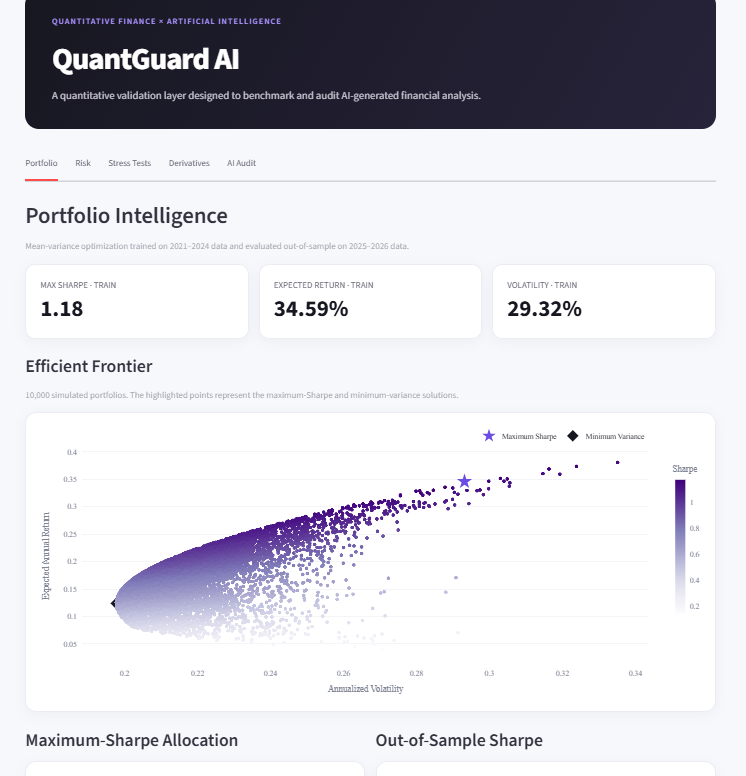
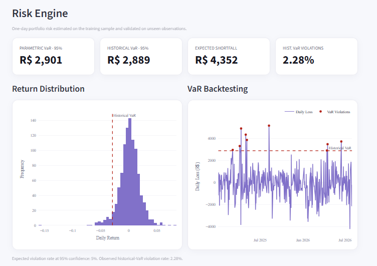
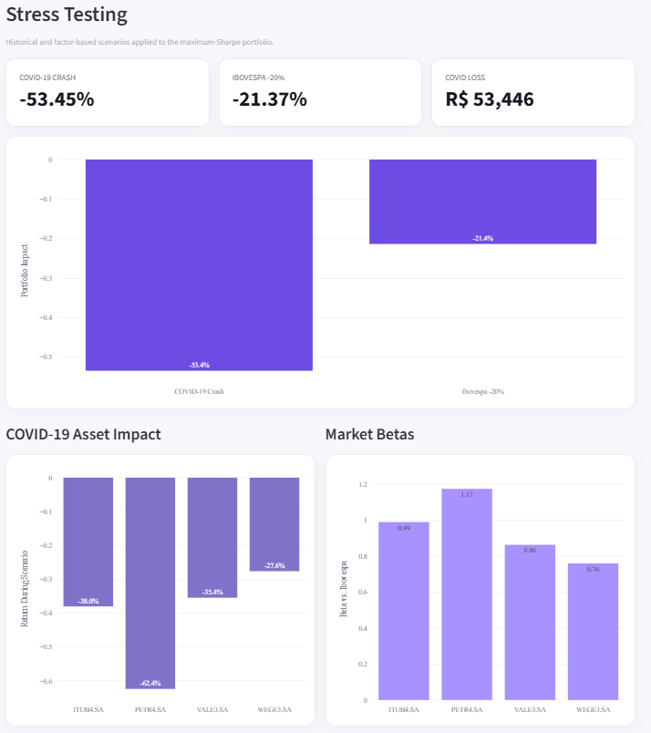
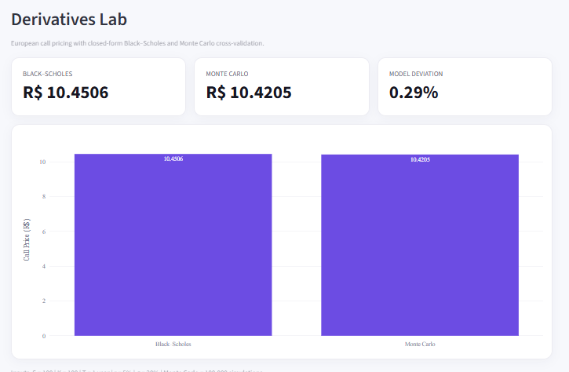
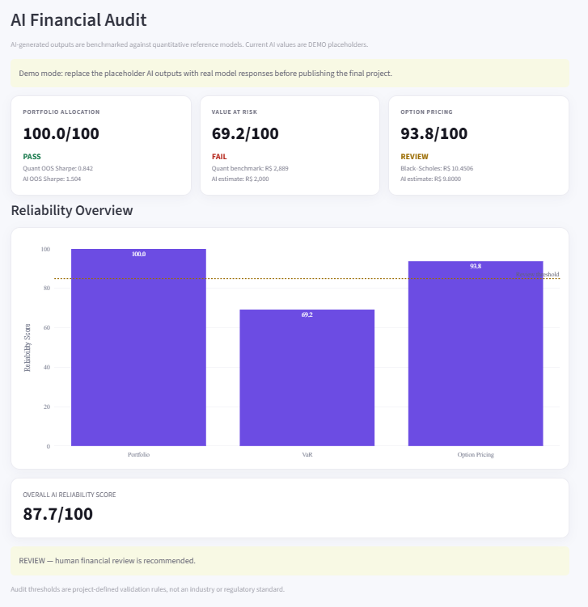

# QuantGuard AI

### Finanças quantitativas como camada de validação para análises produzidas por Inteligência Artificial

**Uma resposta financeira gerada por IA pode parecer convincente. Mas ela faz sentido quando colocada à prova por modelos quantitativos?**

O **QuantGuard AI** nasceu a partir dessa pergunta.

Modelos de linguagem conseguem produzir análises sobre risco, alocação de portfólio e precificação de ativos. Entretanto, uma resposta bem formulada não necessariamente é financeiramente consistente.

A proposta do projeto é utilizar **modelos quantitativos como benchmark para avaliar outputs produzidos por Inteligência Artificial**.

### Visão geral da plataforma

![Visão geral do QuantGuard AI] <p align="center">
  
</p>

## I. A ideia

O QuantGuard acompanha um fluxo semelhante ao de uma análise financeira:

**alocação → risco → stress → derivativos → validação da IA**

Os modelos quantitativos produzem resultados de referência, que posteriormente podem ser comparados às respostas fornecidas por uma IA.

O módulo de auditoria classifica as divergências em:

* **PASS** — resultado suficientemente próximo do benchmark;
* **REVIEW** — resultado plausível, mas que merece revisão;
* **FAIL** — divergência relevante e necessidade de revisão humana.

## II. Portfolio Intelligence

O projeto utiliza dados históricos de:

* PETR4;
* VALE3;
* ITUB4;
* WEGE3.

São calculados retornos, volatilidades e covariâncias, além da simulação de **10.000 carteiras** para construção da Efficient Frontier.

**Maximum Sharpe Portfolio:** carteira que busca maximizar o retorno ajustado ao risco.

**Minimum Variance Portfolio:** carteira que busca minimizar a volatilidade.

A análise utiliza também validação **out-of-sample**:

**Treino:** 2021–2024, período utilizado para otimização dos pesos.

**Teste:** 2025–2026, período utilizado para avaliar esses mesmos pesos em dados que o modelo não utilizou durante a otimização.

Os resultados são comparados ainda a uma carteira **Equal Weight**, com 25% em cada ativo.

A proposta é verificar se uma solução matematicamente ótima no período histórico permanece eficiente quando exposta a dados futuros.

## III. Risk Engine

O QuantGuard calcula o risco da carteira por três medidas principais:

**Parametric VaR:** estima o Value at Risk por meio de uma abordagem paramétrica.

**Historical VaR:** utiliza diretamente a distribuição histórica dos retornos.

**Expected Shortfall:** estima a perda média esperada nos casos em que o VaR é ultrapassado.

<p align="center">
  
</p>


## IV. VaR Backtesting

O VaR calculado no período de treino é testado posteriormente nos dados out-of-sample.

O sistema identifica quantas vezes a perda efetivamente observada ultrapassou o limite previsto.

Para um VaR de 95%, espera-se uma proporção de violações próxima de 5%. Uma frequência significativamente superior pode indicar **subestimação do risco**.


## V. Stress Testing

O projeto utiliza dois tipos de cenário.

**Historical Stress:** aplicação dos pesos atuais da carteira ao comportamento observado durante o crash da COVID-19 em 2020.

**Market Factor Stress:** estimação da sensibilidade dos ativos ao Ibovespa e simulação de um choque de **-20% no índice**.

O beta utilizado na análise é definido por:

$$
\beta_i = \frac{Cov(R_i,R_m)}{Var(R_m)}
$$

Os testes estimam o impacto do cenário sobre os ativos, a perda da carteira e seu valor após o choque.

![Risk e Stress Testing]<p align="center">
  
</p>


## VI. Derivatives Engine

O projeto compara dois métodos independentes para precificação de uma opção europeia.

**Black-Scholes:** solução analítica para o preço da opção.

**Monte Carlo:** simulação do processo estocástico do ativo e cálculo do payoff esperado descontado.

Na execução atual:

**Black-Scholes:** R$ 10,4506
**Monte Carlo:** R$ 10,4205
**Diferença:** aproximadamente **0,29%**.

A proximidade entre os resultados funciona como uma forma de **cross-model validation**.

<p align="center">
  
</p>


## VII. AI Audit

O módulo de auditoria foi estruturado para avaliar três problemas.

**Portfolio Allocation:** compara a performance da carteira sugerida pela IA com o benchmark quantitativo por meio do Sharpe Ratio.

**Risk Estimation:** compara uma estimativa de VaR fornecida pela IA ao resultado calculado pelo Risk Engine.

**Option Pricing:** compara a estimativa da IA aos preços produzidos por Black-Scholes e Monte Carlo.

A auditoria considera:

```text
Numerical Accuracy
Reliability Score
PASS / REVIEW / FAIL
Human Review Required
```

A resposta da IA é fornecida ao sistema como uma entrada independente, sem acesso prévio ao resultado quantitativo utilizado como benchmark.

![AI Audit]<p align="center">
  
</p>


## VIII. Human Review

O objetivo do QuantGuard não é determinar se uma IA é simplesmente boa ou ruim em finanças.

A proposta é identificar **quando um output financeiro está suficientemente próximo de um benchmark quantitativo e quando uma revisão humana deve ser realizada**.

Essa camada de validação representa o ponto central do projeto.

## IX. Arquitetura

```text
Market Data
     ↓
Returns & Statistics
     ↓
Portfolio Engine
Markowitz / Max Sharpe / Min Variance
     ↓
Risk Engine
VaR / Expected Shortfall / Backtesting
     ↓
Stress Engine
Historical Stress / Factor Stress
     ↓
Derivatives Engine
Black-Scholes / Monte Carlo
     ↓
AI Audit
Benchmark × AI Output
     ↓
Dashboard
```

## X. Dashboard

A interface foi desenvolvida em **Streamlit** e dividida em cinco áreas:

**Portfolio:** Efficient Frontier, composição das carteiras e validação out-of-sample.

**Risk:** VaR, Expected Shortfall e backtesting.

**Stress Tests:** cenários históricos e choques de mercado.

**Derivatives:** comparação entre Black-Scholes e Monte Carlo.

**AI Audit:** comparação dos outputs de IA com os benchmarks quantitativos.

## XI. Tecnologias

**Linguagem:** Python.

**Bibliotecas:** Pandas, NumPy, SciPy, yfinance, Plotly e Streamlit.

Estrutura principal:

```text
src/
├── portfolio.py
├── risk.py
├── stress.py
├── derivatives.py
└── ai_audit.py
```

O `app.py` integra os diferentes módulos e apresenta os resultados no dashboard.

## XII. Execução

Clone o repositório:

```bash
git clone <URL-DO-REPOSITORIO>
```

Acesse a pasta:

```bash
cd quantguard-ai
```

Instale as dependências:

```bash
pip install -r requirements.txt
```

Execute:

```bash
streamlit run app.py
```
